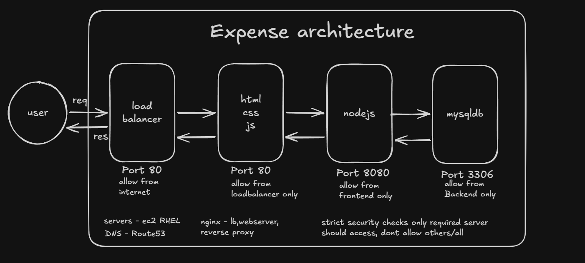
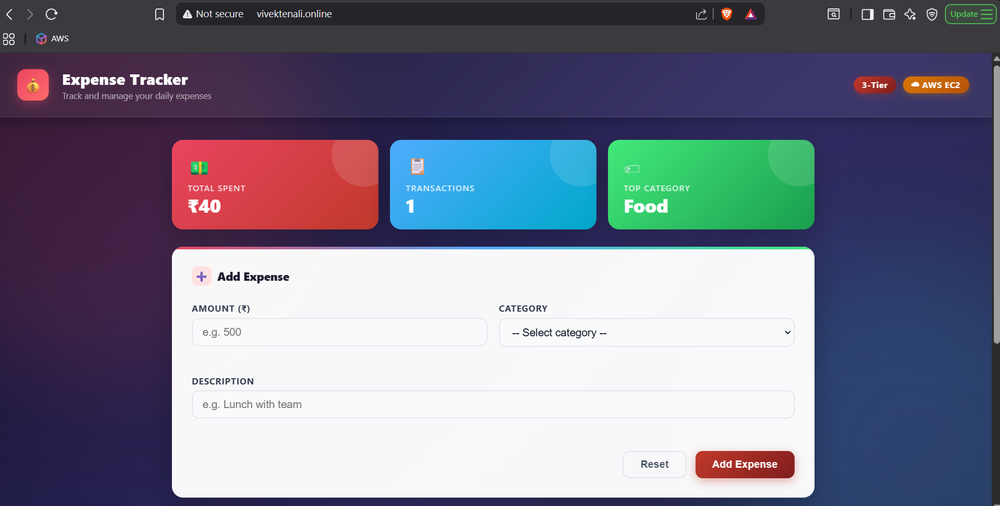
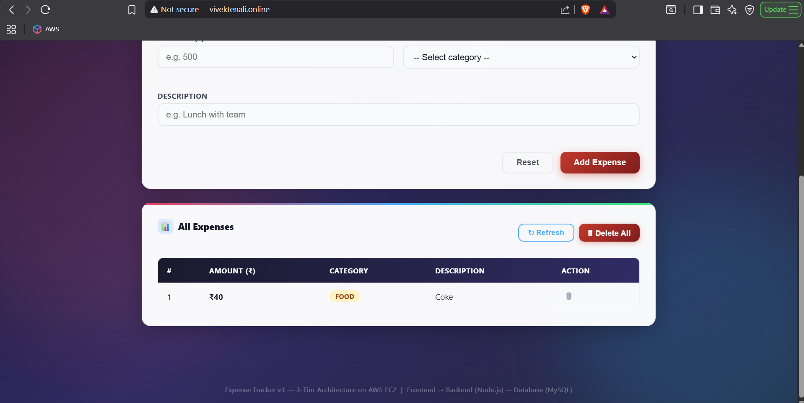
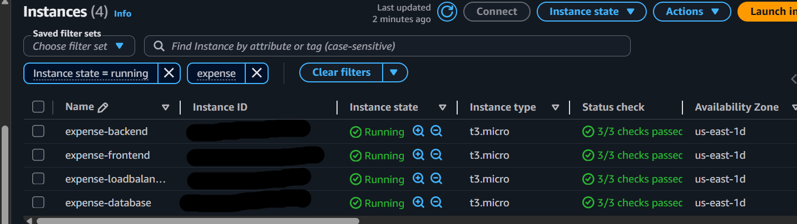
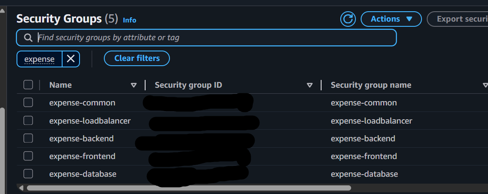
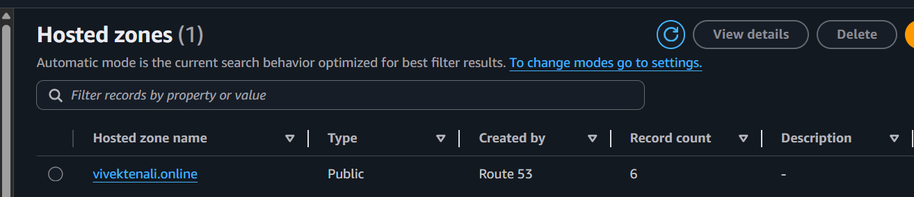

# Expense Tracker App 

An expense management application where users can record and categorize their expenses. The system tracks spending across categories and displays the highest-spending category for better financial insights.

## App Overview



## App Screenshots




## AWS Screenshots





## Tech stack

- Load Balancer (Nginx EC2) 
- Frontend (Nginx)  static UI
- Backend (Node.js 20)
- Database (MySQL 8.0)
- Servers - AWS EC2 RHEL
- DNS - AWS Route53

## About

Instead of manually configuring each server, I wrote shell scripts to automate the entire setup across all tiers:

🗄️ Database Tier : MySQL 8.0 on a dedicated EC2 instance, secured with a private security group allowing inbound traffic only from the backend layer.

⚙️ Backend Tier : Node.js 20 REST API running as a hardened systemd service under a dedicated system user, connected to MySQL and exposing a health endpoint on port 8080.

🌐 Frontend Tier : Nginx serving static assets (HTML/CSS/JS) and acting as a reverse proxy, forwarding /api/ requests to the backend.

⚖️ Load Balancer :A dedicated EC2 instance running Nginx as a pure load balancer, sitting in front of the frontend tier and being the only public-facing entry point.

## Prerequisites
- AWS account
- A RHEL EC2 instances launched
- security groups configured
- Route53 hosted zone ready

## How to Run
- clone the repo
- update the IP Address in each script
- Run each script on the respective EC2 in order(DB -> Backend -> Frontend -> LB)

## Flow

```bash
Internet → LB EC2 → Frontend EC2 → Backend EC2 → MySQL EC2
```
## Verification Steps

- check the connections between each server using: 
```bash
telnet <SERVER_IP> <PORT>
```

## Learnings
✅ Shell scripting to automate multi-server provisioning on RHEL.

✅ AWS Route53 for DNS.

✅ Layered security groups  each tier only talks to its immediate neighbor.

✅ systemd service hardening with least privilege system users.

✅ Nginx as  a reverse proxy, load balancer and web server.

✅ Remote schema loading and DB verification.

✅ Real-world HTTP error behavior (502, 503, 504)
